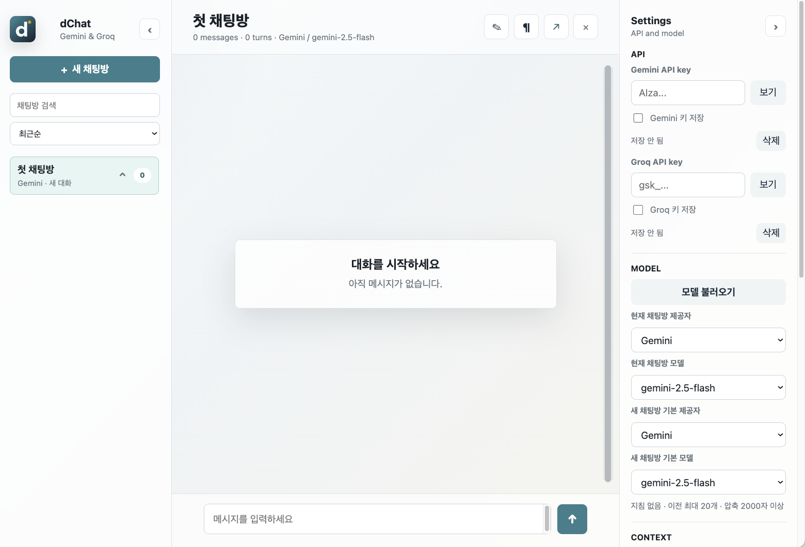

# dChat

Gemini와 Groq API key를 직접 입력해서 사용하는 브라우저 기반 AI 채팅 앱입니다. 별도 서버 없이 정적 웹페이지로 동작하며, 여러 채팅방을 만들고 각 방마다 모델, 지침, 대화 맥락, 테마를 따로 설정할 수 있습니다.

## 화면 미리보기



위 이미지는 API key와 실제 대화가 없는 기본 화면 캡처입니다.

## 주요 기능

- 여러 채팅방 생성, 전환, 이름 변경, 삭제
- 채팅방별 Gemini/Groq 제공자와 모델 선택
- AI 응답별 당시 제공자/모델 표시
- Gemini/Groq API key 별도 입력, 저장, 삭제
- API key로 사용 가능한 Gemini/Groq 모델 목록 불러오기
- 채팅방별 지침 저장 및 모든 요청에 항상 포함
- 이전 대화 포함 여부와 최근 메시지 수 설정
- 전송 예상 크기와 실제 요청 payload 미리보기
- 큰 응답은 화면에는 원문으로 유지하고 요청에는 압축본으로 전송
- 압축본 확인, 직접 편집, 다시 압축
- Markdown 응답 렌더링
- 응답 복사, 재생성, 오류 재시도, 선택 응답까지 브랜치 방으로 복사
- 중요한 AI 응답 찜하기, 찜한 대화 모음, 원본 위치 이동
- 찜한 대화 미리보기/전체내용 전환, Markdown 렌더링, 순서 변경
- 모델 과부하 메시지 발생 시 자동 지연 재요청
- 요청 중지
- 대화 스크롤 미니맵
- 채팅방 검색, 정렬, 고정
- 찜한 대화가 있는 채팅방 삭제 시 경고
- 클린/웜 던/포레스트/잉크/터미널/페이퍼 테마
- 대화 글씨 크기 조절
- 대화와 설정을 브라우저 IndexedDB에 저장, 미지원 환경에서는 localStorage fallback
- PC 3열 레이아웃, 태블릿/모바일 드로어 레이아웃

## 바로 사용하기

이 프로젝트는 빌드 과정이 없는 정적 웹앱입니다.

1. 저장소를 clone합니다.

```bash
git clone https://github.com/darttech-hub/dChat.git
cd dChat
```

SSH를 쓰는 사용자는 `git@github.com:darttech-hub/dChat.git` 경로로 clone해도 됩니다.

2. 로컬 서버를 실행합니다.

```bash
python3 -m http.server 4173
```

3. 브라우저에서 접속합니다.

```text
http://127.0.0.1:4173
```

`index.html`을 직접 열어도 대부분 동작하지만, 브라우저 정책 차이를 줄이려면 로컬 서버 실행을 권장합니다.

## API key 준비하기

이 앱은 사용자의 API key를 서버로 저장하지 않습니다. 입력한 key는 사용자의 브라우저 저장소에만 저장되며, 요청은 사용자의 브라우저에서 Gemini 또는 Groq API로 직접 전송됩니다.

### Gemini API key

1. [Google AI Studio API Keys](https://aistudio.google.com/app/apikey)에 접속합니다.
2. Google 계정으로 로그인하고 필요한 약관을 확인합니다.
3. `Create API key`를 눌러 새 키를 만듭니다.
4. 프로젝트 선택이 필요하면 새 Google Cloud 프로젝트를 만들거나 기존 프로젝트를 선택합니다.
5. 생성된 API key를 복사합니다.
6. dChat의 우측 `Settings > API > Gemini API key`에 붙여넣습니다.
7. 필요하면 `Gemini 키 저장`을 체크합니다.

공식 문서: [Using Gemini API keys](https://ai.google.dev/gemini-api/docs/api-key)

### Groq API key

1. [GroqCloud API Keys](https://console.groq.com/keys)에 접속합니다.
2. Groq 계정으로 로그인합니다.
3. `Create API Key`를 눌러 새 키를 만듭니다.
4. 생성된 API key를 복사합니다.
5. dChat의 우측 `Settings > API > Groq API key`에 붙여넣습니다.
6. 필요하면 `Groq 키 저장`을 체크합니다.

GroqCloud 팀에서는 owner 또는 developer 권한이 있어야 API key를 만들거나 관리할 수 있습니다.

공식 문서: [Groq Quickstart](https://console.groq.com/docs/quickstart)

## 기본 사용법

1. 우측 `API` 영역에 Gemini 또는 Groq API key를 입력합니다.
2. `Model` 영역에서 현재 채팅방의 제공자와 모델을 선택합니다.
3. 필요하면 `모델 불러오기`를 눌러 계정에서 사용 가능한 모델 목록을 가져옵니다.
4. 가운데 입력창에 메시지를 입력하고 전송합니다.
5. 새 주제는 좌측 `새 채팅방`으로 분리해서 관리합니다.
6. 채팅방 제목은 상단 제목을 직접 수정하거나 연필 버튼으로 편집합니다.
7. 문단 아이콘 버튼에서 채팅방 지침을 추가할 수 있습니다.

AI 응답 하단의 아이콘 버튼은 다음 기능입니다.

- `☆`/`★`: AI 응답 찜하기 또는 찜 해제
- 복사 아이콘: 응답 내용 복사
- 리프레시 아이콘: 같은 사용자 메시지 기준으로 다시 생성
- 브랜치 아이콘: 선택한 응답까지 새 채팅방으로 복사
- `압축본`: 긴 응답의 다음 요청용 압축본 확인 및 편집

아이콘 위에 마우스를 올리거나 키보드 포커스를 두면 버튼 이름이 빠르게 표시됩니다.

## 찜한 대화 관리

중요한 AI 응답은 `☆` 버튼으로 찜할 수 있습니다. 사용자가 직접 작성한 메시지는 찜 대상에서 제외됩니다.

찜한 대화가 1개 이상 있으면 좌측 채팅방 목록 맨 위에 `찜한 대화 N개` 항목이 나타납니다. 이 항목을 클릭하면 가운데 화면이 찜한 대화 모음으로 바뀝니다.

찜한 대화 화면에서 할 수 있는 일은 다음과 같습니다.

- 찜한 응답 목록 보기
- `미리보기`와 `전체내용` 표시 방식 전환
- `전체내용` 모드에서 Markdown 렌더링으로 보기
- 찜한 대화가 2개 이상일 때 `위/아래` 버튼으로 순서 변경
- `★` 버튼으로 찜 해제
- 항목 클릭 시 원래 채팅방의 해당 메시지 위치로 이동

찜한 대화 화면은 탐색 전용입니다. 메시지 입력창, 제목 수정, 지침, 공유, 삭제 버튼은 비활성화됩니다.

채팅방을 삭제하거나 마지막 채팅방의 대화를 비울 때 해당 방에 찜한 대화가 있으면 경고가 표시됩니다. 삭제하면 찜한 대화 목록에서도 함께 사라집니다.

## 맥락 관리

우측 `Context` 영역에서 이전 대화를 얼마나 보낼지 조절할 수 있습니다.

- `이전 대화 포함`: 꺼두면 현재 사용자 메시지만 보냅니다.
- `이전 대화 최근 메시지 수`: 켜져 있을 때 최근 N개 메시지만 포함합니다.
- `큰 응답 자동 압축`: 긴 AI 응답은 다음 요청에 원문 대신 압축본을 보냅니다.
- `압축 기준`: 몇 글자 이상부터 압축할지 정합니다.
- `압축 길이`: 압축본 최대 길이를 정합니다.
- `보기`: 이번 요청에 실제로 포함될 내용을 확인합니다.

긴 응답의 `압축본` 버튼을 누르면 숨겨진 압축본을 확인하고 직접 수정할 수 있습니다. `다시 압축`을 누르면 현재 로직으로 압축본을 다시 만듭니다.

## 테마와 화면 설정

우측 `View` 영역에서 테마와 대화 글씨 크기를 바꿀 수 있습니다.

- `클린`: 기본 밝은 테마
- `웜 던`: 따뜻한 톤
- `포레스트`: 녹색 계열
- `잉크`: 다크 테마
- `터미널`: 검은 배경과 발광 초록 글씨의 레트로 터미널 테마
- `페이퍼`: 문서형 저채도 테마

선택한 테마와 글씨 크기는 브라우저 로컬DB에 저장됩니다.

## Render Static Web Service 배포

Render에서 정적 사이트로 배포할 수 있습니다.

- Service type: `Static Site`
- Build Command: 비워두거나 필요 시 없음
- Publish Directory: `.`

배포 후 사용자는 각자 자신의 Gemini/Groq API key를 브라우저에 입력해서 사용합니다.

## 보안 주의

이 앱은 정적 웹앱이라 API 요청이 사용자의 브라우저에서 직접 발생합니다. 개인용 또는 테스트용으로는 간단하지만, 공개 서비스에서 운영자가 하나의 API key를 넣어 모두에게 제공하는 구조에는 적합하지 않습니다.

- API key를 GitHub에 커밋하지 마세요.
- 다른 사람의 API key를 대신 입력하거나 공유하지 마세요.
- 공용 PC에서는 key 저장 체크를 사용하지 않는 것이 좋습니다.
- 의심되는 사용량이 있으면 Gemini/Groq 콘솔에서 key를 삭제하거나 새로 발급하세요.
- 실제 상용 서비스로 운영하려면 서버 프록시를 두고 API key를 서버 환경변수로 관리하는 구조가 더 안전합니다.

Google도 Gemini API key를 비밀번호처럼 취급하고, 클라이언트 측 노출을 피하라고 안내합니다. Groq 역시 API key를 안전하게 보관하라고 안내합니다.

## 저장 정책

dChat은 저장소를 하나로 합치지 않고 역할별로 나눠 씁니다. 긴 대화 데이터와 민감한 API key를 분리해서 관리하기 위한 구조입니다.

### 앱 데이터

아래 데이터는 기본적으로 IndexedDB에 저장됩니다.

- 채팅방 목록
- 메시지와 압축본
- 메시지 작성 시각, AI 응답 당시 제공자/모델
- 찜한 대화 상태와 표시 순서
- 모델 목록
- 현재 채팅방/모델 설정
- 이전 대화 포함 설정
- 테마와 글씨 크기
- 찜한 대화 표시 방식

IndexedDB를 사용할 수 없는 브라우저 환경에서는 localStorage로 fallback합니다.

### API key

Gemini/Groq API key는 앱 데이터와 분리해서 저장합니다.

- `키 저장` 체크 ON: localStorage에 저장되어 브라우저를 다시 열어도 유지됩니다.
- `키 저장` 체크 OFF: sessionStorage에 저장되어 현재 브라우저 세션에서만 유지됩니다.

이 분리 구조 덕분에 나중에 대화 내보내기/백업 기능을 추가하더라도 API key가 실수로 포함될 위험을 줄일 수 있습니다.

다른 브라우저나 다른 기기에서는 데이터가 자동 동기화되지 않습니다.

## 문제 해결

- 응답이 오지 않으면 API key가 올바른지 확인하세요.
- 모델 목록이 비어 있으면 해당 계정에서 사용할 수 있는 모델 권한을 확인하세요.
- 요청 크기가 너무 크면 `이전 대화 최근 메시지 수`를 줄이거나 `큰 응답 자동 압축`을 켜세요.
- 모델 과부하 메시지가 나오면 앱이 자동으로 몇 초 기다렸다가 재요청합니다.
- 브라우저 저장 데이터가 꼬였다고 판단되면 사이트 데이터 삭제 후 다시 설정하세요.

## 라이선스

개인 프로젝트용 정적 웹앱입니다. 공개 배포 시 사용하는 모델 제공자의 약관과 요금 정책을 확인하세요.
